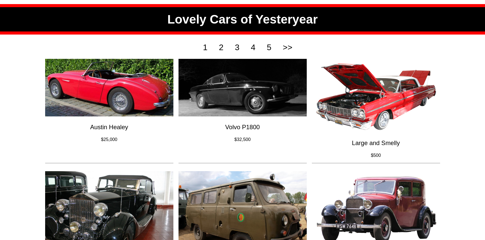
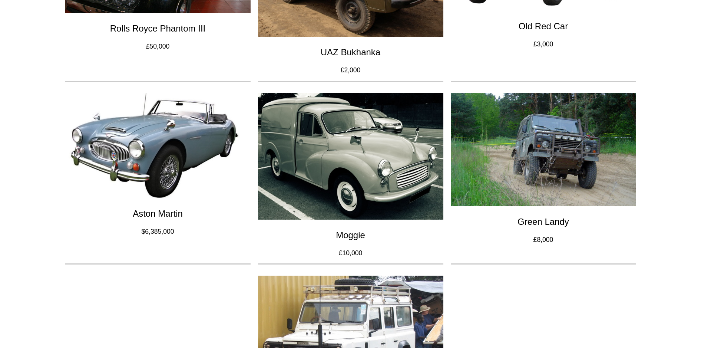
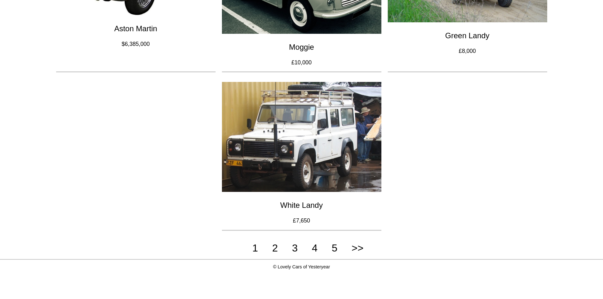

# CarsOfLovelyYear-Pug

A static website built with Pug templates, showcasing a collection of cars from various years. Inspired by Richard Stibbard's "Pug Templating" tutorial, this project demonstrates the power and flexibility of Pug for creating dynamic and maintainable web pages.

## Screenshots

